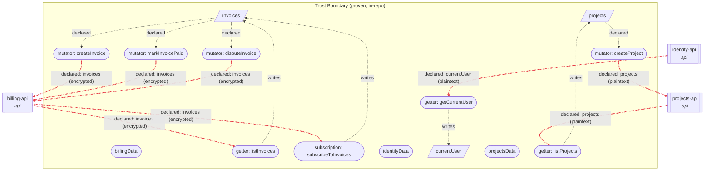

<!-- GENERATED FILE -- do not edit by hand. Run `npx data-cap` to regenerate. -->

> Machine-generated engineering artifact assembled from statically-provable code facts and author-declared documentation. It can support a security, privacy, or compliance review. It does not itself establish compliance with any standard.

> Projected from data-cap's Evidence Model (ADR 0050/0054), the same source every other generated artifact draws from. This run also wrote it to `docs/data.evidence.json`.

# Data Flow Diagram & Security Data-Flow Review

This report cannot trace data *through* a third-party system once it reaches an external-service/api endpoint -- what that system does with it afterward is unknowable to a static scan of one repository. It does not assign a regulatory classification, since that's jurisdiction-specific; record it in a capability's `metadata` instead (see `specs/decisions/0049-capability-metadata-vocabulary.md`).

## Security Data-Flow Review

### Critical (error)

_None._

### Warnings

- **UNCONSUMED_FIELD**: Field "projects" on "projectsData" is written but never statically read in the scanned project.
- **SENSITIVE_DATA_CROSSES_EXTERNAL_BOUNDARY**: Field "invoices" on "billingData" is sensitivity "confidential" and has a declared endpoint crossing an external-service/api/queue boundary -- verify this is intentional and adequately protected.
- **SENSITIVE_DATA_CROSSES_EXTERNAL_BOUNDARY**: Field "currentUser" on "identityData" is sensitivity "confidential" and has a declared endpoint crossing an external-service/api/queue boundary -- verify this is intentional and adequately protected.
- **SENSITIVE_DATA_CROSSES_EXTERNAL_BOUNDARY**: Field "projects" on "projectsData" is sensitivity "internal" and has a declared endpoint crossing an external-service/api/queue boundary -- verify this is intentional and adequately protected.

### Informational

- **INDETERMINATE_CONSUMER**: "src/server/legacy-compliance-sync.ts" accesses "billingData" using a dynamic/computed property -- can't be statically characterized.
- **FIELD_DYNAMIC_ACCESS_DECLARED**: Per developers, this data point is dynamically accessed at src/server/legacy-compliance-sync.ts:26:19.
- **INDETERMINATE_CONSUMER**: "src/server/legacy-compliance-sync.ts" accesses "identityData" using a dynamic/computed property -- can't be statically characterized.
- **FIELD_ACCESS_INDETERMINATE**: Field "currentUser" on "identityData" appears unused, but there are instances of dynamic/computed access on this capability that can't be statically attributed to a specific field -- it may be one of them.

## System overview diagram

