<!-- GENERATED FILE -- do not edit by hand. Run `npx data-cap` to regenerate. -->

> Machine-generated engineering artifact assembled from statically-provable code facts and author-declared documentation. It can support a security, privacy, or compliance review. It does not itself establish compliance with any standard.

> Projected from data-cap's Evidence Model (ADR 0050/0054), the same source every other generated artifact draws from. This run also wrote it to `docs/data.evidence.json`.

# Data Flow Diagram & Security Data-Flow Review

This report cannot trace data *through* a third-party system once it reaches an external-service/api endpoint -- what that system does with it afterward is unknowable to a static scan of one repository. It does not assign a regulatory classification, since that's jurisdiction-specific; record it in a capability's `metadata` instead (see `specs/decisions/0049-capability-metadata-vocabulary.md`).

## Security Data-Flow Review

### Critical (error)

_None._

### Warnings

- **SENSITIVE_DATA_CROSSES_EXTERNAL_BOUNDARY**: Field "myTasks" on "assignmentsData" is sensitivity "internal" and has a declared endpoint crossing an external-service/api/queue boundary -- verify this is intentional and adequately protected.
- **SENSITIVE_DATA_CROSSES_EXTERNAL_BOUNDARY**: Field "members" on "memberData" is sensitivity "internal" and has a declared endpoint crossing an external-service/api/queue boundary -- verify this is intentional and adequately protected.
- **SENSITIVE_DATA_CROSSES_EXTERNAL_BOUNDARY**: Field "project" on "projectData" is sensitivity "internal" and has a declared endpoint crossing an external-service/api/queue boundary -- verify this is intentional and adequately protected.
- **SENSITIVE_DATA_CROSSES_EXTERNAL_BOUNDARY**: Field "tasks" on "projectData" is sensitivity "internal" and has a declared endpoint crossing an external-service/api/queue boundary -- verify this is intentional and adequately protected.

### Informational

- **DUPLICATE_ENDPOINT_ACROSS_CAPABILITIES**: Endpoint "https://api.example.com/v1/members" is declared by both "assignmentsData"'s getter "getMyTasks" and "memberData"'s getter "listMembers" -- possibly a duplicate network fetch across independently-declared capabilities; worth a look if that wasn't intentional.

## System overview diagram

```mermaid
%% System overview -- declared endpoints and proven consumers per capability
flowchart TB
  subgraph boundary["Trust Boundary (proven, in-repo)"]
    n0(["assignmentsData"])
    n1[/"myTasks"/]
    n3(["getter: getMyTasks"])
    n6(["memberData"])
    n7[/"members"/]
    n8(["getter: listMembers"])
    n10(["projectData"])
    n11[/"project"/]
    n13(["getter: getProject"])
    n14[/"tasks"/]
    n15(["mutator: createTask"])
    n16(["mutator: toggleTask"])
    n17(["mutator: assignTask"])
  end
  n2[["assignments-api<br/><em>api</em>"]]
  n4[["members-api<br/><em>api</em>"]]
  n5["src/main.ts"]
  n9["src/capabilities/project.capability.ts"]
  n12[["projects-api<br/><em>api</em>"]]
  n2 -.->|"declared: myTasks (plaintext)"| n3
  n3 -.->|"writes"| n1
  n4 -.->|"declared: myTasks (plaintext)"| n3
  n3 -.->|"writes"| n1
  n1 -->|"proven: src/main.ts:91:14"| n5
  n4 -.->|"declared: members (plaintext)"| n8
  n8 -.->|"writes"| n7
  n7 -->|"proven: src/capabilities/project.capability.ts:31:19"| n9
  n12 -.->|"declared: project (plaintext)"| n13
  n13 -.->|"writes"| n11
  n11 -->|"proven: src/main.ts:78:14"| n5
  n12 -.->|"declared: tasks (plaintext)"| n13
  n13 -.->|"writes"| n14
  n14 -.->|"declared"| n15
  n15 -.->|"declared: tasks (plaintext)"| n12
  n14 -.->|"declared"| n16
  n16 -.->|"declared: tasks (plaintext)"| n12
  n14 -.->|"declared"| n17
  n17 -.->|"declared: tasks (plaintext)"| n12
  n14 -->|"proven: src/main.ts:79:14"| n5
  n14 -->|"proven: src/main.ts:81:3"| n5
  n14 -->|"proven: src/main.ts:111:14"| n5
  n14 -->|"proven: src/main.ts:116:3"| n5
  n14 -->|"proven: src/main.ts:121:14"| n5
  n14 -->|"proven: src/main.ts:128:3"| n5
  n14 -->|"proven: src/main.ts:142:22"| n5
  linkStyle 0 stroke:#e63946,stroke-width:3px
  linkStyle 2 stroke:#e63946,stroke-width:3px
  linkStyle 5 stroke:#e63946,stroke-width:3px
  linkStyle 8 stroke:#e63946,stroke-width:3px
  linkStyle 11 stroke:#e63946,stroke-width:3px
  linkStyle 14 stroke:#e63946,stroke-width:3px
  linkStyle 16 stroke:#e63946,stroke-width:3px
  linkStyle 18 stroke:#e63946,stroke-width:3px
```

