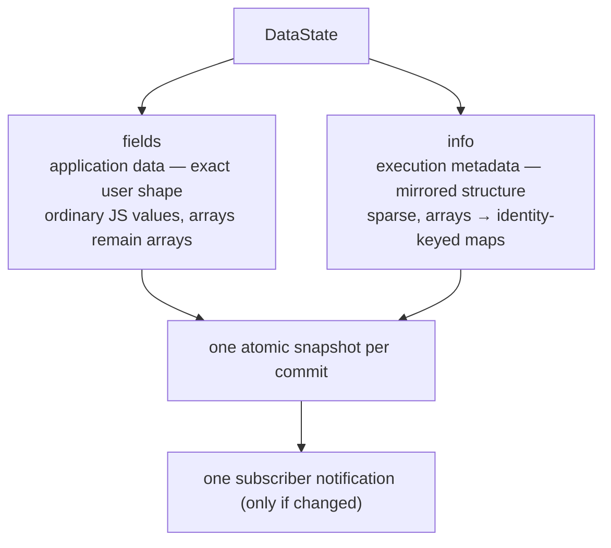
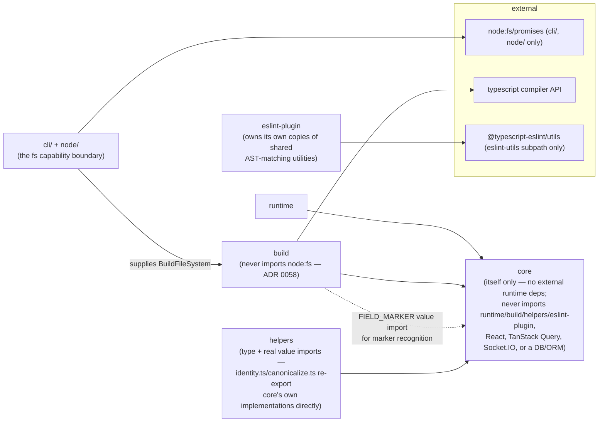
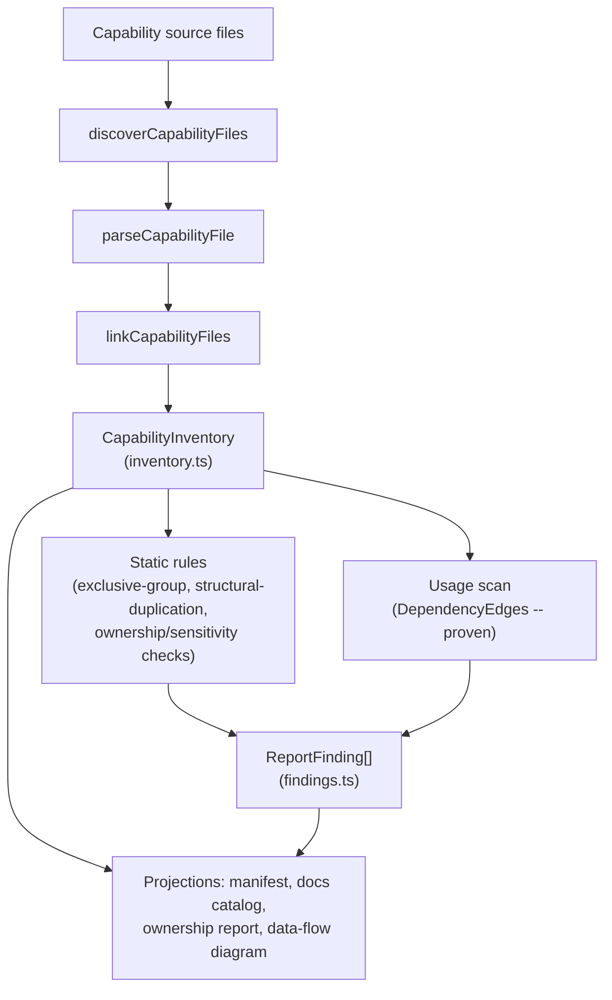

# Architecture

Canonical current-state description of how `data-cap` is built and what guarantees its architecture
provides. [`decisions/`](decisions/) holds the reasoning trail (the ADRs); this document is the
destination those decisions arrived at, not the argument for them. For the product overview and
integration guidance, see [README.md](../README.md) and [GUIDE.md](../GUIDE.md).

**Status**: all six entry points (`core`, `runtime`, `helpers`, `build`, `evidence`,
`eslint-plugin`) are implemented, tested, and shipped.

- [Purpose](#purpose)
- [Core invariants](#core-invariants)
- [The entry points](#the-entry-points)
- [`core/` — the executable, analyzable contract](#core--the-executable-analyzable-contract)
- [`fields` and `info` — always present, always atomic](#fields-and-info--always-present-always-atomic)
- [`runtime/` — the optional standalone runtime](#runtime--the-optional-standalone-runtime)
- [`helpers/` — optional convenience utilities](#helpers--optional-convenience-utilities)
- [`build/` — Node-only, static-analysis-only build tooling](#build--node-only-static-analysis-only-build-tooling)
- [`eslint-plugin/` — two rules](#eslint-plugin--two-rules)
- [Cross-cutting guarantees, checked in CI](#cross-cutting-guarantees-checked-in-ci)
- [Architectural decisions](#architectural-decisions)

## Purpose

> `data-cap` defines executable, analyzable data contracts that explicitly
> describe application data and the operations capable of acquiring,
> mutating, or continuously observing that data, while remaining independent
> of databases, transports, frameworks, and state-management libraries.

`data-cap` does not fetch, store, or transport data itself — a capability declares the fields it
owns (`buildData`/`createData`) and, optionally, documentation metadata describing them
(`documentData`); the runtime validates and commits state transitions against that declaration, and
separately, at build time, static analysis discovers every declared capability across a project to
produce manifests, documentation, ownership reports, and data-flow evidence.



## Core invariants

These are the guarantees the rest of the design exists to uphold. Each links to the section that
describes its mechanics.

### `fields` and `info` are always committed as one atomic snapshot

No code path may update `fields`/`info` independently or in separate ticks — a consumer must never
observe `{newFields, oldInfo}` or `{oldFields, newInfo}`. See
[`fields` and `info`](#fields-and-info--always-present-always-atomic) and
[ADR 0008](decisions/0008-fields-info-atomic-commit.md).

### `DataInfo` is mandatory, never optional

Every `DataState` is `{ fields, info }`, both always present and populated together — the
performance mechanism is structural sparsity, never removability. See
[`fields` and `info`](#fields-and-info--always-present-always-atomic) and
[ADR 0007](decisions/0007-datainfo-mandatory-not-optional.md).

### The build tool never imports, requires, or evaluates a discovered file

Discovery and linking read a file's AST via the TypeScript Compiler API only — a capability file is
never imported, `require()`d, or `eval()`d. This preserves the safety boundary required for CI
environments and large monorepos. See
[`build/`](#build--node-only-static-analysis-only-build-tooling) and
[ADR 0002](decisions/0002-build-tooling-static-analysis-only.md).

### `./build` does not acquire filesystem access implicitly

`./build` never imports `node:fs` itself — every public options object requires a caller-supplied
`BuildFileSystem` capability. The `data-cap` CLI (`src/cli/`) is the executable boundary that
constructs the real `node:fs/promises` adapter and hands it in; a consumer running the generators
from their own Node script imports that same adapter from `data-cap/node`. This is the
same discipline `repo-contract`'s ADR-0011 established for `spawn`/`env`, and mirrors env-cap's own
ADR 0040. See [ADR 0058](decisions/0058-library-surfaces-do-not-acquire-node-fs.md).

### No automatic rollback or conflict resolution

An optimistic mutation's pending transition is either confirmed (`commitAuthoritative`) or removed
(`removePendingTransition`) — there is no invented rollback mechanism or conflict-resolution policy
beyond that. See [ADR 0023](decisions/0023-no-automatic-rollback-or-conflict-resolution.md).

### Dedup and subscription sharing are scoped to function identity, not behavioral equality

`coordinator.dedupe`/`acquireSubscription` share work across calls with the same function identity
and canonically-equal params — an inline arrow function is a fresh identity every time, and never
shares. See [`runtime/`](#runtime--the-optional-standalone-runtime) and
[ADR 0026](decisions/0026-subscription-transport-sharing-independent.md)–[ADR 0028](decisions/0028-coordinator-dedup-key-identity-plus-params.md).

### Capabilities do not self-redact `fields`/`info`

Unlike env-cap's runtime contracts, `data-cap` treats `fields`/`info` as ordinary application data,
not secrets by default — an application storing genuinely sensitive data in a field is responsible
for its own redaction at the point it logs. See [SECURITY.md](../SECURITY.md) and
[ADR 0006](decisions/0006-no-self-redaction.md).

## The entry points

```
src/
├── core/           data-cap                 (isomorphic, zero deps)
├── runtime/        data-cap/runtime          (optional, standalone state)
│                   data-cap/runtime/cache     (optional, separately tree-shaken)
│                   data-cap/runtime/retry     (optional, separately tree-shaken)
├── helpers/        data-cap/helpers          (optional utilities)
├── build/          data-cap/build            (Node-only build tooling, never imports node:fs)
├── evidence/       data-cap/evidence         (Evidence Model projections)
└── eslint-plugin/  data-cap/eslint-plugin    (lint rules)
```

`src/cli/` (the `data-cap` bin, not a `package.json#exports` subpath) and `src/node/` (the
`data-cap/node` executable-context entry) are the two places `node:fs` is acquired —
see [ADR 0058](decisions/0058-library-surfaces-do-not-acquire-node-fs.md).

Dependency direction, enforced by convention and by the tree-shaking/
gzip-budget/dual-package-hazard test suite (`test/*/tree-shaking.test.ts`,
`scripts/check-size.mjs`, `test/runtime/dual-package-hazard.test.ts`):



`eslint-plugin` imports nothing from this package at all — no arrow from it
to `core` above is missing by omission, it's the point: it never imports
`eslint`'s own main entry either, which would pull in a runtime
`require("eslint")` that breaks once bundled into dependency-free ESM
output.

No first-party integration/adapter packages (TanStack Query, Socket.IO, a
particular database driver, ...) ship from this repository — see
[ADR 0037](decisions/0037-no-first-party-integration-packages.md).
Integration patterns are demonstrated end-to-end in
[`test/integration/`](../test/integration/) instead
(`adoption-patterns/tanstack-query-integration/`,
`subscriptions/socket-io-subscription/`), so application authors copy and
adapt code directly rather than depending on an opinionated adapter layer
this package would otherwise have to keep compatible with two moving
external targets.

## `core/` — the executable, analyzable contract

Pure, synchronous, deterministic — nothing here owns a promise, a timer, a
listener, or mutable module-level state (that's `runtime`'s job).

- **`fields.ts`** — `fields.nullable(x)`/`fields.optional(x)`: thin markers
  recognized only at schema-authoring time, resolving to `null`/`undefined`
  defaults respectively, regardless of `x` (which only drives type
  inference). Never leak into the resolved `fields` object.
- **`types.ts`** — pure type-only module: `FieldsShape`, `InferFields`,
  `InferFieldValue`, `FieldOwnership`, `DataState`/`DataInfo`/`FieldInfo`/
  `DataStatus`/`DataError`/`SubscriptionInfo`/`DataStore`,
  `BuildDataConfig`, `PendingTransition`, `DeepPartial`. Uses the same
  generic-bound variance workaround env-cap's `EnvSchema`/`InferEnvValue`
  use, so `S extends FieldsShape` infers precise per-key literal types from
  the object literal actually passed to `buildData`. Also declares the
  pure operation vocabulary the runtime's `createData` executes —
  `GetterDefinition`/`MutatorDefinition`/`SubscriptionDefinition`,
  `DataSchema`, `OwnedPatch` (a mapped type narrowing `DeepPartial<T>` to
  exactly what a declared `writes` ownership permits) — none of it
  implies runtime behavior on its own; only `runtime/capability.ts`
  executes anything (see [ADR 0048](decisions/0048-builddata-createdata-split-and-optional-operations-layer.md)).
- **`schema.ts`** — `resolveFieldDefaults` (schema → resolved defaults,
  cycle-detected via a "currently visiting" stack) and
  `checkValueAgainstSchema` (per-field structural shape checking, used by
  `ownership.ts`'s reset-to-default path).
- **`patch.ts`** — `patchInto`/`commitState`/`project`/`deepFreezeNewNodes`:
  the single sanctioned way to transition a `DataState`. See "`fields` and
  `info`" below.
- **`ownership.ts`** — `resolveOperationPatch`: walks a processor's returned
  patch, enforcing the declared field-ownership boundary (`Object.hasOwn`
  only, never truthiness/`in`), resetting an individually-invalid leaf to
  its own schema default without disturbing valid siblings.
- **`identity.ts`** — `computeItemIdentity`/`reconcileArrayInfo`: array
  identity computation and reference-stable `DataInfo` reconciliation.
  Internal — re-exported publicly, unchanged, from `helpers/identity.ts`.
- **`canonicalize.ts`** — `canonicalize`: deterministic, self-delimiting,
  type-tagged string encoding, shared by array identity keying and the
  coordinator's dedup key. Internal — re-exported publicly, unchanged, from
  `helpers/canonicalize.ts`.
- **`build.ts`** — `buildData(config)`. Builds and deep-freezes the
  initial `DataState` (`{fields, info}`, both present from the start) from
  declared defaults. Throws synchronously at call time for structural
  schema violations (a function-valued default, a cyclic default); never
  throws on ordinary field access — `data.fields.*` is always synchronously
  readable, a deliberate divergence from env-cap's `createEnv`. Renamed
  from `createData` (ADR 0048) — behaviorally unchanged; the name now
  belongs to the runtime's batteries-included entry point instead (see
  `runtime/capability.ts` below).
- **`document.ts`** — `documentData(config, docs)`. Inert (`void config;
void docs`), structurally mirrors `DataSchema`'s own shape (fields plus
  optional getters/mutators/subscriptions) rather than a loose bag,
  whether `config` is ultimately passed to `buildData` or the runtime's
  `createData`; a pure AST marker for `build` tooling to discover.
- **`errors.ts`** — throw-based error hierarchy with a stable `code`
  discriminant (`DataCapError`, `InvalidFieldDefaultError`); never embeds
  raw field/processed values in a message.

## `fields` and `info` — always present, always atomic

Two invariants govern every `DataState`:

1. **`DataInfo` is mandatory, never optional or separately tree-shakeable**
   ([ADR 0007](decisions/0007-datainfo-mandatory-not-optional.md)).
   `DataState<TFields> = { readonly fields: TFields; readonly info:
DataInfo<TFields> }` — both members always present, always populated
   together. The performance mechanism is structural **sparsity** (no
   eagerly-allocated metadata for untouched fields) and **reference-stable
   reconciliation** ([ADR 0010](decisions/0010-datainfo-array-reconciliation-identity-diffed.md)),
   never removability.
2. **`fields` and `info` are always committed and published as one atomic
   snapshot** ([ADR 0008](decisions/0008-fields-info-atomic-commit.md)). No
   code path may update them independently or in separate ticks. A consumer
   must never observe `{newFields, oldInfo}` or `{oldFields, newInfo}`.

`fields` remain ordinary arrays; only `info` uses identity-keyed objects for
array items ([ADR 0009](decisions/0009-fields-arrays-info-identity-keyed.md))
— `data.fields.comments` is `Comment[]`; `data.info.comments` is keyed by
each item's declared `identity`. `DataInfo` array reconciliation is
identity-diffed, not a full teardown-and-rebuild: an identity untouched by a
given operation retains its previous `FieldInfo` object reference across a
`fields`-array replacement.

## `runtime/` — the optional standalone runtime

Stateful, timer/listener-owning, optional. Two ways to use it: hand-wired
(`createDataStore` + `coordinator` directly, application code wires
`execute`/`processor` functions itself — see `test/integration/runtime-core/basic-standalone/`
for the reference pattern) or batteries-included (`createData`, below,
composes the same primitives for you). Neither is "the" way — see
[ADR 0048](decisions/0048-builddata-createdata-split-and-optional-operations-layer.md).
No first-party TanStack Query/Socket.IO/React adapter ships either way —
see [ADR 0037](decisions/0037-no-first-party-integration-packages.md).

- **`store.ts`** — `createDataStore(initialState)`. Owns
  `authoritativeState` and `pendingTransitions`; exposes `getSnapshot()`/
  `subscribe()` (a `useSyncExternalStore`-compatible `DataStore` contract,
  with no React import) whose visible value is always
  `project(authoritativeState, pendingTransitions)`, recomputed fresh on
  every read, never cached. `commitAuthoritative`/`addPendingTransition`/
  `removePendingTransition` are the full mutation surface.
- **`coordinator.ts`** — `createCoordinator()`/`defaultCoordinator`.
  `dedupe()` shares one in-flight call across concurrent calls with the
  same function identity and canonically-equal params.
  `acquireSubscription()` ref-counts one shared transport per `subscribe`
  function identity. `defaultCoordinator` is a module-level singleton;
  `createCoordinator()` gives an explicit, isolated domain (a multi-tenant
  server process, test isolation).
- **`abort.ts`** — `composeSignals`/`rejectOnAbort`: per-caller
  `AbortSignal` composition that never lets one caller's own abort cancel
  shared underlying work another caller still depends on.
- **`cache.ts`** _(own entry point: `./runtime/cache`)_ —
  `createDataCache(options)`: an optional, bounded, LRU-evicting cache of
  complete `DataState` snapshots, keyed by an opaque caller-computed string.
- **`retry.ts`** _(own entry point: `./runtime/retry`)_ —
  `withRetry(fn, signal, options)`/`isStillDefault`: optional, opt-in retry
  with abort-awareness and a documented "only retry a still-default field"
  policy.
- **`capability.ts`** — `createData(schema, options?)`, Experimental tier.
  Composes `buildData({fields: schema.fields})` + `createDataStore(...)`
  - a `Coordinator` (default `defaultCoordinator`, overridable) — no new
    core/runtime primitive behavior, purely an orchestration layer over the
    ones above. Per declared getter/mutator/subscription, builds one stable
    dispatch closure at `createData()` call time (never per invocation) and
    passes it to `coordinator.dedupe`/`acquireSubscription`, so dedup/
    subscription-sharing identity is inherently (this instance × this
    operation × canonicalized params) without changing `coordinator.ts`'s
    own signature at all. Adds a genuinely new, additive reactive
    `operations` namespace to its own richer `getSnapshot()` (keyed by
    operation name then canonicalized params, LRU-bounded) — this is _not_
    a duplicate of `fields`/`info`; it answers a question `info.<field>`
    structurally cannot (whether two differently-parameterized calls to the
    same operation are concurrently in flight). See
    [ADR 0048](decisions/0048-builddata-createdata-split-and-optional-operations-layer.md)
    for the full behavioral contract (Promise rejection semantics, getter-
    vs-mutator stale-discard asymmetry, `optimistic()` receiving
    authoritative-not-projected state) and the two real bugs building this
    surfaced (cross-bundle `FIELD_MARKER` identity; a capability's own
    subscription release never reaching its own `onStatusChange` callback).

## `helpers/` — optional convenience utilities

Type-only _and_ real value imports from `core` (identity/canonicalize are
literal re-exports of core's own implementations, never reimplementations).
Entirely optional — neither `buildData` nor the runtime (including
`createData`) has any knowledge of this module and behaves identically
without it. Ships four separately tree-shakeable namespaces from one
`./helpers` entry:

- **`processors`** — coercion helpers (`toNumber`, `toBoolean`, `toDate`,
  ...) for use inside a hand-written `processor(raw, ctx)` function. Never
  throw — a processor's returned patch already runs through ownership/shape
  checking downstream.
- **`identity`** — `computeItemIdentity`/`reconcileArrayInfo`, the exact
  primitives the standalone runtime would use internally, exposed for
  application code building its own array-info wiring.
- **`canonicalize`** — the same canonicalization primitive `identity` and
  the coordinator's dedup key both use internally.
- **`shape`** — structural (never business-rule) type guards
  (`isPlainObject`, `isDate`, `isURL`, `isRegExp`, `isNullish`) —
  deliberately not a validator system; data-cap has no per-field validator
  vocabulary (see [ADR 0039](decisions/0039-helpers-subpath-scope.md)).

## `build/` — Node-only, static-analysis-only build tooling

Never imports, `require()`s, or `eval()`s a discovered file
([ADR 0002](decisions/0002-build-tooling-static-analysis-only.md)) — every
discovery/linking operation reads a file's AST via the TypeScript Compiler
API and nothing else. Never imports `node:fs` either — every public options
object requires a caller-supplied `fs: BuildFileSystem`
([ADR 0058](decisions/0058-library-surfaces-do-not-acquire-node-fs.md)); the
`data-cap` CLI supplies the real `node:fs/promises` adapter, and a
programmatic consumer imports the same adapter from `data-cap/node`.

- **`discover.ts`** — `discoverCapabilityFiles(options)`: recursively finds
  `.ts`/`.tsx` files under a root, pruning `node_modules`/`.git` (and any
  caller-supplied exclusions) during the walk itself.
- **`parse.ts`** — `parseCapabilityFile(filePath, sourceText)`: finds
  `buildData()`/`createData()`/`documentData()` calls in one file's
  top-level statements, matching by call/property name alone (not import
  provenance). For a `createData()` call specifically, also extracts its
  static getter/mutator/subscription **names** and literal `writes`
  shapes — never the operations' own function bodies (ADR 0002).
- **`literal-eval.ts`** — `evaluateLiteral`/`getStaticPropertyName`: a
  narrow, explicitly allow-listed grammar of statically-safe expression
  forms (object/array/primitive literals, `Date`/`URL`/`RegExp`/`Map`/`Set`
  constructor calls with literal arguments, `fields.nullable`/
  `fields.optional` marker recognition).
- **`link.ts`** — `linkCapabilityFiles(files, options)`: resolves each
  `buildData()`/`createData()` call's `fields` reference to a real,
  literal-evaluated shape (following relative imports, tsconfig path
  aliases, and allow-listed cross-package imports — `resolution/`, below);
  correlates `documentData()` calls with the capability they document,
  surfacing every mismatch category explicitly
  ([ADR 0040](decisions/0040-build-tooling-detects-correlation-mismatches.md)).
- **`resolution/`** — `resolve-import.ts`/`resolve-tsconfig-paths.ts`/
  `resolve-package-schema.ts`/`resolve-within-root.ts`: specifier-to-file
  resolution (relative, tsconfig-alias, cross-package), relocated from and
  kept in sync with env-cap's own equivalent folder
  ([ADR 0043](decisions/0043-env-cap-resolver-relocated-and-duplicated.md)).
- **`inventory.ts`** — `buildInventory(linkResult)`: a pure function
  turning a `LinkResult` into the one authoritative `CapabilityInventory`
  every report generator reads from — `CapabilityNode`/`FieldNode`/
  `OperationNode`, with a field's `owner` already resolved (its own, else
  the capability's) and an operation's statically-extracted `writes` shape
  already resolved down to the top-level field paths it covers. Touches no
  filesystem or AST itself ([ADR 0049](decisions/0049-capability-metadata-vocabulary.md)).
- **`findings.ts`** / **`dependency-types.ts`** — the shared `ReportFinding`/
  `ReportSeverity` and `DependencyEdge`/`DependencyRelationship` vocabulary
  every static rule and usage-scan pass emits into, so "what counts as a
  conflict" is defined once. Pure type-only modules — see "Report-generation
  model" below.

### Report-generation model



Every projection (a generated manifest, the docs catalog, an ownership
report, the data-flow diagram) reads the same `CapabilityInventory` and the
same `ReportFinding[]` — no generator re-derives conflict or flow logic
independently. `Rules` (no file-tree scan needed) and `Scan` (the more
expensive, optional AST walk over the whole project) are deliberately
separate passes: a generator that only needs ownership/sensitivity data
never pays for the usage scan it doesn't need.

See [`generated-artifacts.md`](generated-artifacts.md) for exactly which
artifacts this pipeline produces today, which industry model each aligns
with, and — just as importantly — which related artifacts (threat modeling
inputs, a privacy data map, OSCAL/PCI/SOC 2 evidence) are explicitly
deferred rather than silently unsupported.

## `eslint-plugin/` — two rules

Owns its own copies of shared AST-matching utilities rather than importing
from `core`/`build` — imports only `@typescript-eslint/utils`'s narrow
`eslint-utils` subpath and `@typescript-eslint/types`/`@typescript-eslint/
scope-manager`, never `eslint`'s own main entry (which does a runtime
`require("eslint")` that breaks once bundled into dependency-free ESM
output).

- **`stable-operation-reference.ts`** — flags an inline function literal, or
  a reference recreated on every call (via real scope analysis, not just
  syntax), assigned to a `createData()` call's `execute`/`processor`/
  `subscribe`/`optimistic` key — the one mistake class specific enough to
  this package's identity-based sharing architecture to warrant a
  dedicated rule ([ADR 0038](decisions/0038-eslint-plugin-single-rule.md)).
  Needed no code change for `createData` to gain this shape (ADR 0048) —
  it already matched the literal name `"createData"`, dormant scaffolding
  for exactly this feature.
- **`no-node-fs.ts`** — the filesystem analogue of env-cap's rule of the
  same name: flags any `import`/`require`/dynamic `import()` of `node:fs`
  outside an allow-listed executable boundary, so a consuming project can
  enforce the same "accept a filesystem capability, don't acquire one
  implicitly" discipline `./build` itself follows
  ([ADR 0058](decisions/0058-library-surfaces-do-not-acquire-node-fs.md)).

## Cross-cutting guarantees, checked in CI

- **Tree-shaking** (`test/helpers/tree-shaking.test.ts`,
  `test/runtime/tree-shaking.test.ts`): every optional namespace/entry point
  is provably absent from a downstream bundle that doesn't import it.
- **Gzip budgets** (`scripts/check-size.mjs`, run in CI's `verify` job):
  every consumer-facing entry point (`core`, `runtime`, `runtime/cache`,
  `runtime/retry`, `helpers`) carries a hard size ceiling.
- **Dual-package hazard** (`test/runtime/dual-package-hazard.test.ts`):
  the known, unavoidable consequence of `defaultCoordinator`'s module-
  singleton design under mixed ESM/CJS resolution is checked and pinned,
  not just assumed
  ([ADR 0041](decisions/0041-dual-package-hazard-checked-documented.md)).
- **Cross-runtime conformance** (`test/cross-runtime/{bun,deno}.test.ts`):
  core+runtime's isomorphism claim is verified against real Bun and Deno
  engines, not just Node/vitest.
- **No ambient filesystem access** (`scripts/verify-no-ambient-fs.mjs`, run
  in CI's `verify`/`precommit` jobs): a real `npm pack` tarball is grepped
  for `node:fs` reachable outside the CLI/`./node`/`./eslint-plugin`
  exceptions ([ADR 0058](decisions/0058-library-surfaces-do-not-acquire-node-fs.md)).
- **End-to-end examples** (`examples/*`, `test/examples/*.test.ts`): 3
  audience-shaped flagship npm projects (`application/`, `team-service/`,
  `enterprise-platform/`) exercising the package's adoption story against
  the actual built package, each with a committed golden output — see
  [`examples/README.md`](../examples/README.md).
- **Integration fixtures** (`test/integration/**`,
  `test/integration/*/*.test.ts`): 16 further real, independently-installed
  npm projects, each proving one specific mechanism against the actual
  built package — relocated out of `examples/` when it narrowed to the 3
  flagships above, with zero coverage lost. See
  [`test/integration/README.md`](../test/integration/README.md).

## Architectural decisions

See [`decisions/`](decisions/) for the full, numbered ADR set (0001–0058),
and [`decisions/0047-negative-guarantees-checklist.md`](decisions/0047-negative-guarantees-checklist.md)
specifically for the consolidated list of every hard "never" invariant this
design makes, each traced to its owning test.

Every ADR mapped to the specific boundary above it documents — a longer
table than env-cap's own architecture doc has, because this package has
more than double env-cap's ADR count. Start here rather than skimming all
58 sequentially when you only care about one boundary:

| Boundary                                                                                                                              | ADRs                                                                                                                                                                                                                                                                                                                                                                                                                                                                                                                                                                                                                                                                                                                                                                                                                                                                                                                                                                                                                                                                                                                    |
| ------------------------------------------------------------------------------------------------------------------------------------- | ----------------------------------------------------------------------------------------------------------------------------------------------------------------------------------------------------------------------------------------------------------------------------------------------------------------------------------------------------------------------------------------------------------------------------------------------------------------------------------------------------------------------------------------------------------------------------------------------------------------------------------------------------------------------------------------------------------------------------------------------------------------------------------------------------------------------------------------------------------------------------------------------------------------------------------------------------------------------------------------------------------------------------------------------------------------------------------------------------------------------- |
| `core/` contract shape (`documentData`/`buildData`, field values, warn-vs-throw, redaction)                                           | [0001](decisions/0001-documentdata-mirrors-createdata-shape.md), [0002](decisions/0002-build-tooling-static-analysis-only.md), [0003](decisions/0003-fields-are-actual-application-data.md), [0004](decisions/0004-fields-always-synchronously-readable.md), [0005](decisions/0005-warn-not-throw-runtime-throw-schema-authoring.md), [0006](decisions/0006-no-self-redaction.md), [0042](decisions/0042-no-op-suppression.md), [0048](decisions/0048-builddata-createdata-split-and-optional-operations-layer.md), [0049](decisions/0049-capability-metadata-vocabulary.md)                                                                                                                                                                                                                                                                                                                                                                                                                                                                                                                                            |
| `fields`/`info` shape and atomicity                                                                                                   | [0007](decisions/0007-datainfo-mandatory-not-optional.md), [0008](decisions/0008-fields-info-atomic-commit.md), [0009](decisions/0009-fields-arrays-info-identity-keyed.md), [0010](decisions/0010-datainfo-array-reconciliation-identity-diffed.md), [0014](decisions/0014-fieldinfo-current-metadata-not-history.md), [0015](decisions/0015-error-latest-only-never-array.md), [0016](decisions/0016-status-state-machine.md), [0017](decisions/0017-fieldinfo-optimistic-flag.md), [0018](decisions/0018-array-identity-config-object.md), [0019](decisions/0019-canonicalization-self-delimiting-encoding.md), [0020](decisions/0020-no-identity-no-per-item-info.md)                                                                                                                                                                                                                                                                                                                                                                                                                                               |
| Field/operation ownership (`writes`, processor patches)                                                                               | [0011](decisions/0011-getter-mutator-ownership-rules.md), [0012](decisions/0012-invalid-field-resets-to-own-default.md), [0013](decisions/0013-thrown-processor-whole-operation-failure.md)                                                                                                                                                                                                                                                                                                                                                                                                                                                                                                                                                                                                                                                                                                                                                                                                                                                                                                                             |
| `runtime/` — store, optimistic mutations, coordinator, subscriptions                                                                  | [0021](decisions/0021-authoritative-pending-project-model.md), [0022](decisions/0022-completing-operation-uses-current-state.md), [0023](decisions/0023-no-automatic-rollback-or-conflict-resolution.md), [0024](decisions/0024-getter-concurrency-stale-response-discard.md), [0025](decisions/0025-mutator-concurrency-completion-order.md), [0026](decisions/0026-subscription-transport-sharing-independent.md), [0027](decisions/0027-default-coordinator-singleton-plus-factory.md), [0028](decisions/0028-coordinator-dedup-key-identity-plus-params.md), [0029](decisions/0029-subscription-disconnect-never-mutates-fields.md), [0030](decisions/0030-recover-resync-runs-once-no-replay-guarantee.md), [0031](decisions/0031-abortsignal-composed-internally.md), [0034](decisions/0034-optional-runtime-features-separate-entries.md), [0035](decisions/0035-cache-persists-complete-datastate-atomically.md), [0036](decisions/0036-retry-opt-in-with-explicit-constraints.md), [0041](decisions/0041-dual-package-hazard-checked-documented.md), [0044](decisions/0044-snapshots-deep-frozen-amortized.md) |
| `helpers/` scope                                                                                                                      | [0039](decisions/0039-helpers-subpath-scope.md)                                                                                                                                                                                                                                                                                                                                                                                                                                                                                                                                                                                                                                                                                                                                                                                                                                                                                                                                                                                                                                                                         |
| `build/` — static analysis, resolution, correlation                                                                                   | [0002](decisions/0002-build-tooling-static-analysis-only.md), [0032](decisions/0032-tsconfig-path-alias-resolution-ported.md), [0033](decisions/0033-literal-eval-explicit-constructor-allowlist.md), [0040](decisions/0040-build-tooling-detects-correlation-mismatches.md), [0043](decisions/0043-env-cap-resolver-relocated-and-duplicated.md)                                                                                                                                                                                                                                                                                                                                                                                                                                                                                                                                                                                                                                                                                                                                                                       |
| `build/` — canonical fact models (Capability/Dependency/Ownership/Finding/Change/Runtime Contract/Evidence) and reference projections | [0049](decisions/0049-capability-metadata-vocabulary.md), [0050](decisions/0050-fact-model-architecture.md)                                                                                                                                                                                                                                                                                                                                                                                                                                                                                                                                                                                                                                                                                                                                                                                                                                                                                                                                                                                                             |
| `eslint-plugin/` scope                                                                                                                | [0038](decisions/0038-eslint-plugin-single-rule.md)                                                                                                                                                                                                                                                                                                                                                                                                                                                                                                                                                                                                                                                                                                                                                                                                                                                                                                                                                                                                                                                                     |
| Cross-cutting: integration policy, testing discipline                                                                                 | [0037](decisions/0037-no-first-party-integration-packages.md), [0045](decisions/0045-type-level-tests-pair-positive-negative.md), [0046](decisions/0046-property-based-tests-extend-to-patch-ownership.md), [0047](decisions/0047-negative-guarantees-checklist.md)                                                                                                                                                                                                                                                                                                                                                                                                                                                                                                                                                                                                                                                                                                                                                                                                                                                     |
| Library surfaces (`./build`) never import `node:fs`; a caller supplies a `BuildFileSystem`                                            | [0058](decisions/0058-library-surfaces-do-not-acquire-node-fs.md)                                                                                                                                                                                                                                                                                                                                                                                                                                                                                                                                                                                                                                                                                                                                                                                                                                                                                                                                                                                                                                                       |

Some ADRs appear under more than one boundary (e.g. 0002 governs both the
general static-analysis-only rule and `build/`'s specific implementation of
it) — that's intentional; the table optimizes for "where do I look for
context on boundary X," not for a strict partition.
